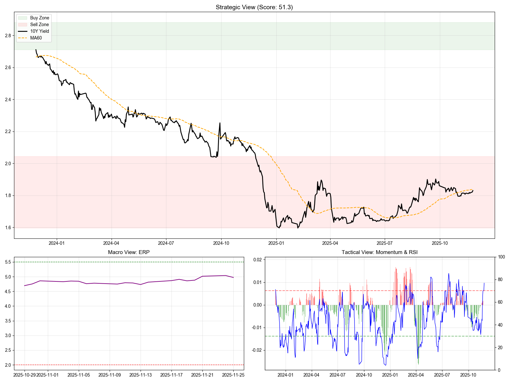

# 🏆 债基智能投顾分析报告

> **生成时间**: 2025-11-26 17:22:15

---

## 🔮 综合评分: 51.3 分

### 🌤️ 当前天气: **☁️ 多云 (震荡)**

---

## 📊 核心指标拆解

| 维度 | 指标值 | 状态 | 解释 |
| :--- | :--- | :--- | :--- |
| **国债收益率** | **1.8301%** | - | 债市锚点 |
| **估值水位** | **15.7%** | 🔴 极贵 | 历史分位数 (越高越便宜) |
| **长期趋势** | 牛 | 🟢 Yield < MA60 | 60日均线判定 |
| **短期动量** | 恶化 | 🔴 金叉(涨) | MACD 动能 |
| **宏观对冲** | PE=14.7 | ⚖️ 股债平衡 | 股债性价比 (ERP) |
| **流动性** | 1.32% | ⚖️ 适度 | 资金面松紧 (Shibor) |

---

## 💡 投资操作建议

### 🐢 稳健型 (理财替代)
> **【卧倒不动】多看少动，拿住票息即可。**

### 🐇 激进型 (波段交易)
> **【网格交易】高抛低吸，做小波段。**

---

## 📈 市场全景图

---

*免责声明：本报告由量化程序自动生成，仅供参考，不构成投资建议。*
